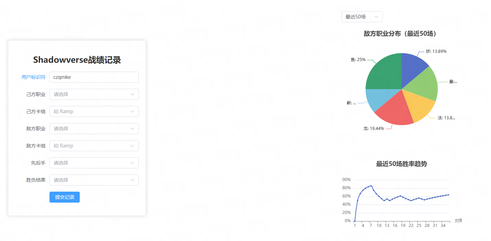

# shadowverse-analyzer-beyond
**S**haderverse analy**Z**er **B**eyond (SZB) is a Shaderverse WB data analyze tool, which helps you to analyze the data of your battle result.

Example:

[TRY NOW: szb.info](http://szb.info)

## Get Start
`cd frontend && npm install element-plus axios`

- 后端启动：`cd backend && python main.py`
- 修改api host: `mv frontend/public/backend_ip.example frontend/public/backend_ip` and **modify it to your own**
- 前端启动：`cd frontend && npm run dev`

## TODOs
1. ~~数据记录~~
  - ~~记录每场对局的~~
    - ~~己方职业~~
    - ~~己方卡组~~
    - ~~敌方职业~~
    - ~~敌方卡组~~
    - ~~先/后手~~
    - ~~win/lose~~
    - ~~添加记录时间~~
    - ~~添加玩家识别码~~

2. 数据可视化，需要：
  最近 20/50/100 场的对局情况，包括
  - ~~最近n场遇到的职业分布（饼图）~~
  - ~~胜率趋势（折线图）~~

3. 数据显示优化
  - 显示最新 n 场比赛的**详细情况**，以表格方式给出
  - 显示本月总场数，胜率
  - 添加职业细分数据，以及 先手 & 后手胜率

## Betters
1. ~~己方职业、卡组提交后不清空前端~~
2. ~~添加前端动态读取backend_ip~~

## Bugs
1. ~~最近n场没有生效，现在显示的是全部的~~
2. ~~胜率趋势计算不太对~~